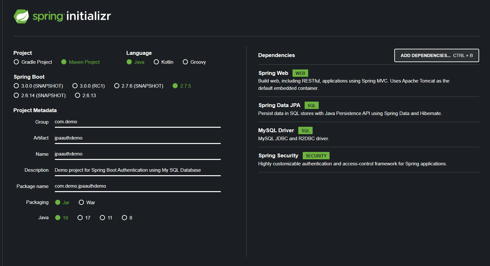
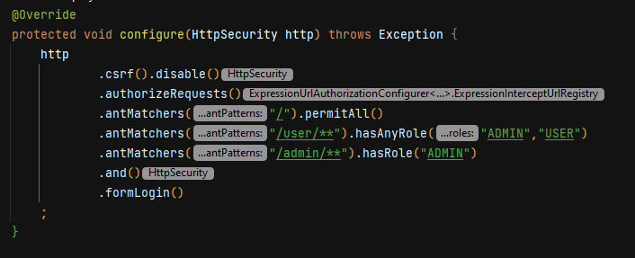
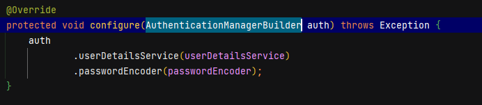
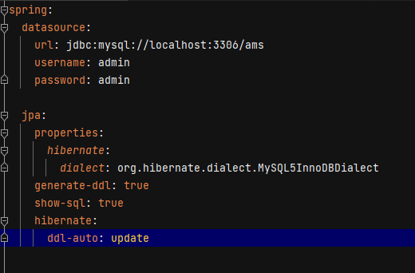
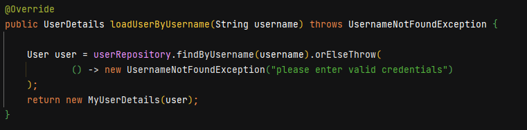

# Spring Security JPA Authentication

-> Create a New Spring Boot Project

-> Add the Following Dependencies:

        * Spring Web
        * Spring Security
        * My-SQL Driver
        * Spring Data JPA

-> Create the Api Endpoints(Accessible by different roles)

-> Create ApplicationSecurityConfiguration class 

-> Override AuthenticationManagerBuilder and HttpSecurity **configure** Method

-> Configure the Data Source and JPA Properties in application.properties file.

-> Create MyUserDetailsService which implements UserDetailsService of Spring Security Core

-> Create MyUserDetails Class which implements UserDetails class of Spring Security Core

-> Create User Model/Entity class which consists properties required by UserDetails Class and other properties.

-> Create UserRepository interface and create a findByUserName method which will be used in UserDetailsService class.

-> insert the values present under [SQL File](src/main/resources/data.sql) data.sql file for admin and user roles

-> Run the application by default it will launch on 8080 port.

